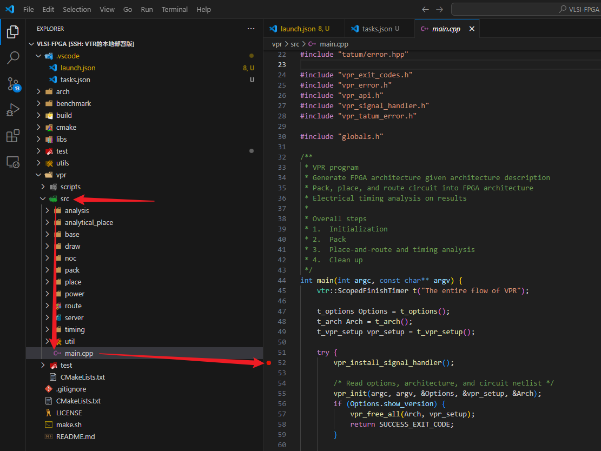

# VTR 工作环境配置

## 环境准备
- 检查宿主机是否支持`perf`指令，如果不能，需要跳过有关rr-debug的部分。安装教程参考[Cnblog](https://blog.csdn.net/z1026544682/article/details/115329534)。
  - 如果是Docker容器启动，在启动镜像前最好设置`--cap-add SYS_ADMIN`，从而可以正常使用rr-debug。不建议使用较老的系统，还要自行折腾gcc的升级。
  - 如果是虚拟机，可尝试在虚拟机内部安装并使用perf工具。检查是否正常工作，运行`perf --help`是否正常显示所有帮助信息。
- 检查环境中gcc的版本，运行`gcc -version`返回的版本号需要`>=10`。如果是`clang`则需要`>=11`。
- 全程最好有github访问支持，以防止网络问题导致编译失败。

### 基础环境
需要安装基础编译环境：
```bash
apt update
apt install -y cmake 
apt install -y bison flex zlib1g zlib1g-dev tcl8.6-dev libreadline-dev libffi-dev libtbb-dev pkg-config
apt install -y ccache git wget curl 
```
可选配置项，根据个人系统实际情况选择：
```bash
# 如果系统存在的gcc编译器满足前面提到的要求，这条命令可忽略
apt install -y gcc-11 g++-11 
# 以下这条指令与rr-debug相关，自行决定是否安装，要求系统支持perf指令
apt-get install linux-tools-common linux-tools-$(uname -r) # rr 调试器需要使用到 perf 工具
```

#### Docker启动
<mark>如果是虚拟机可以跳过这个小章节。</mark><br>
我们以ubuntu:22.04基础镜像为例：
- --cap-add SYS_ADMIN允许docker容器使用perf指令，这对于之后部署rr-debug至关重要。
  - 再次提醒：检查宿主机是否支持使用perf指令，否则docker内部仍然无法使用。之后rr-debug也无法使用，这条指令毫无意义。

```bash
docker run --cap-add SYS_ADMIN -itd -p 8022:22 --name="VPR" ubuntu:22.04 /bin/bash
docker exec -it VPR /bin/bash
apt install -y gcc-11 g++-11 gdb
```

### 拉取并编译项目代码

```bash
git clone https://github.com/Customized-Computing/VLSI-FPGA.git
cd VLSI-FPGA
mkdir build
sh make.sh
```
> 编译期间需要联网访问github以获得资源，务必保证网络通畅。

如果看到以下运行结果说明编译成功：

```bash
[ 98%] Building CXX object vpr/CMakeFiles/libvpr.dir/src/timing/read_sdc.cpp.o
[100%] Building CXX object vpr/CMakeFiles/libvpr.dir/src/timing/slack_evaluation.cpp.o
[100%] Building CXX object vpr/CMakeFiles/libvpr.dir/src/timing/timing_fail_error.cpp.o
[100%] Building CXX object vpr/CMakeFiles/libvpr.dir/src/timing/timing_util.cpp.o
[100%] Building CXX object vpr/CMakeFiles/libvpr.dir/src/util/hash.cpp.o
[100%] Building CXX object vpr/CMakeFiles/libvpr.dir/src/timing/timing_graph_builder.cpp.o
[100%] Building CXX object vpr/CMakeFiles/libvpr.dir/src/util/vpr_utils.cpp.o
[100%] Linking CXX static library libvpr.a
[100%] Built target libvpr
[100%] Building CXX object vpr/CMakeFiles/vpr.dir/src/main.cpp.o
[100%] Linking CXX executable vpr
lto-wrapper: warning: using serial compilation of 13 LTRANS jobs
[100%] Built target vpr
(VPR) root@0be0dbd108b5:~/VLSI-FPGA#
```

运行以下代码以检查VPR模块是否正确编译：
```bash
./build/vpr/vpr arch/stratix10_arch.timing.xml benchmark/flattened_timer.blif
```

观察到以下结果说明程序没有问题：
```bash
Incr Slack updates 1 in 0.000465027 sec
Full Max Req/Worst Slack updates 1 in 0.000197811 sec
Incr Max Req/Worst Slack updates 0 in 0 sec
Incr Criticality updates 0 in 0 sec
Full Criticality updates 1 in 0.00104656 sec
Flow timing analysis took 3.20806 seconds (2.6542 STA, 0.553867 slack) (201 full updates: 26 setup, 0 hold, 175 combined).
VPR succeeded
The entire flow of VPR took 62.63 seconds (max_rss 362.6 MiB)
(base) root@96dd2831fa21:/vpr_master/test# 
```

同时会在当前目录下生成大约11个文件，代表当前代码应用到具体芯片上的设计结果，其中：
- `.net`文件是多种元件打包的结果，文件细节可以学习这个说明文档[VTR/.net](https://docs.verilogtorouting.org/en/latest/vpr/file_formats/#packed-netlist-format-net)。
- `.place`文件则是布局结果，具体细节可以看这个文档说明[VTR/.place](https://docs.verilogtorouting.org/en/latest/vpr/file_formats/#placement-file-format-place)。（作业一是实现布局算法）
- `.route`文件则是布线结果，具体细节可以看这个文档说明[VTR/.route](https://docs.verilogtorouting.org/en/latest/vpr/file_formats/#routing-file-format-route)。（作业二是实现布线算法）

```bash
(base) root@96dd2831fa21:/vpr_master/test# tree
.
|-- flattened_timer.net
|-- flattened_timer.net.post_routing
|-- flattened_timer.place
|-- flattened_timer.route
|-- packing_pin_util.rpt
|-- pre_pack.report_timing.setup.rpt
|-- report_timing.hold.rpt
|-- report_timing.setup.rpt
|-- report_unconstrained_timing.hold.rpt
|-- report_unconstrained_timing.setup.rpt
`-- vpr_stdout.log

1 directory, 11 files
```

### 调试环境

<mark>注意，整个项目源文件非常大，导致GDB加载符号表的时间很长（大约1分钟时间才能进入调试，在自己机器上可能会更久）。<br>
因此一定要养成良好的编程习惯，不要写一点函数就执行整个项目的调试，利用自行编写的单元测试函数实现函数正确性的验证。</mark>

本教程基于Vscode搭建调试环境，同学们可以自行尝试用`Visual stdio`、`CLion`等常规IDE，或者`Trae`这种AI高度融合的IDE。

> 推荐同学们安装一个Ai加持的IDE。在VScode中，推荐安装一个marscode插件，然后按照插件教程部署写代码的Ai。


在Vscode中使用F5的Debug功能，我们需要创建两个配置文件告诉Vscode如何执行项目的Debug工作。
1. 创建一个文件夹`.vscode`和两个文件`launch.json`和`task.json`。
2. `launch.json`填写以下内容：

```json
{
    // Use IntelliSense to learn about possible attributes.
    // Hover to view descriptions of existing attributes.
    // For more information, visit: https://go.microsoft.com/fwlink/?linkid=830387
    "version": "0.2.0",
    "configurations": [
        {
            "name": "g++ - Build and debug active file",
            "type": "cppdbg",
            "request": "launch",
            "program": "${cwd}/build/vpr/vpr",
            "args": [
                "${cwd}/arch/stratix10_arch.timing.xml",
                "${cwd}/benchmark/flattened_pulse_width_led.blif",
                "-j",
                "8"
            ],
            "stopAtEntry": false,
            "cwd": "${fileDirname}",
            "environment": [],
            "externalConsole": false,
            "MIMode": "gdb",
            "setupCommands": [
                {
                    "description": "Enable pretty-printing for gdb",
                    "text": "-enable-pretty-printing",
                    "ignoreFailures": true
                }
            ],
            "preLaunchTask": "build",
            "miDebuggerPath": "/usr/bin/gdb"
        }
    ]
}
```
3. `task.json`填写以下内容：

```json
{
    "version": "2.0.0",
    "tasks": [
        {
            "label": "cmake",
            "type": "shell",
            "command": "cmake",
            "args": [
                "../"
            ],
            "options": {
                "cwd": "${cwd}/build"
            }
        },
        {
            "label": "make",
            "type": "shell",
            "command": "make",
            "args": [
                "-j",
                "24",
                "CMAKE_PARAMS=\"-DVTR_IPO_BUILD=off\"",
                "vpr"
            ],
            "options": {
                "cwd": "${cwd}/build"
            },
            "dependsOn": ["cmake"]
        },
        {
            "label": "build",
            "dependsOn": ["cmake", "make"]
        }
    ]
}
```

这个时候，回到主页，在这个位置打一个断点。然后按F5或者点击菜单`Run`下面的`Starting Debugging`。
<br>
经过一番漫长的等待后，成功进入到熟悉的Vscode调试状态，Vscode停在了指定的位置。
